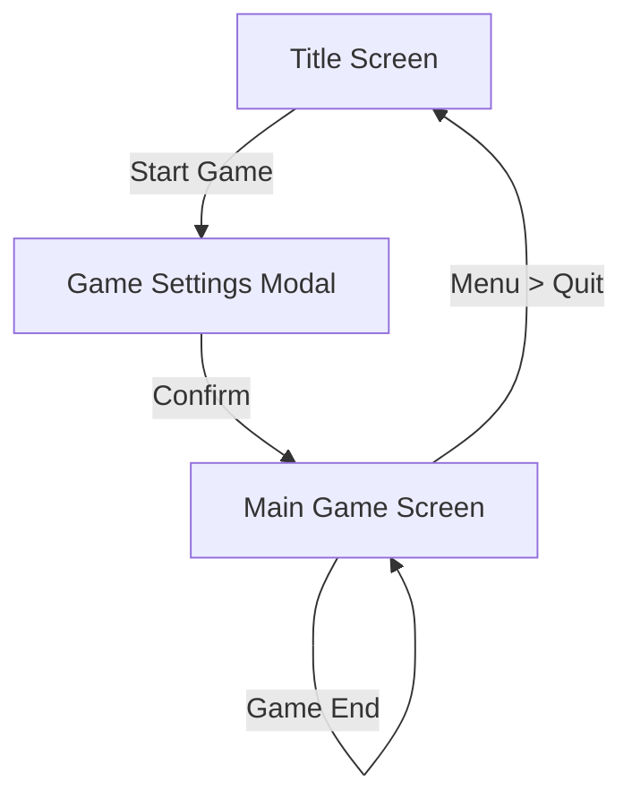

# 外部設計書 (External Design Document)

## 1. デザインコンセプト
- **テーマ**: "Digital Luxury Poker"
- **カラーパレット**:
  - Background: Deep Black / Charcoal (`#0F172A` ~ `#1E293B`)
  - Accent: Gold / Amber (`#F59E0B`), Royal Blue (`#1E40AF` for highlights)
  - Text: Off-white / Silver (`#F1F5F9`)
  - Cards: High contrast, SVG vector graphics.
- **Typography**: Inter or Roboto (Clean sans-serif), Monospace for numbers/chips.

## 2. 画面遷移図 (Screen Flow)

## 3. 画面詳細設計

### 3.1 タイトル画面 (Title Screen)
- **要素**:
  - ロゴ: "Mix Poker"
  - 背景: ポーカーチップやカードの抽象的なダーク背景。
  - ボタン:
    - "Play Now" (メインアクション)
    - "Settings" (現在はDisableまたは簡易設定)
- **挙動**:
  - "Play Now" クリックで設定モーダルを開く。

### 3.2 ゲーム設定モーダル (Settings Modal)
- **要素**:
  - **Game Type**: "Seven Card Stud Hi" (固定表示, 将来的に選択可能に)
  - **Opponents**: スライダー or ボタン (2 ~ 7人, Default: 6)
  - **Stakes**: "$5/$10/$40/$80" (固定表示)
  - **Start Button**: ゲーム開始。
- **モバイル考慮**:
  - フルスクリーンモーダルとして表示し、指で操作しやすい大きさにする。

### 3.3 メインゲーム画面 (Main Game Screen)
最も重要な画面。

#### A. レイアウト構成 (Layout Strategy)
- **Desktop**: 16:9 比率を想定。中央に広くテーブルを配置。
  - テーブルは横長に表示
  - 上部 80%: テーブルエリア (プレイヤーやチップ・配布カードなど表示)
  - 下部 20%: コミュニティ情報 (Pot, Game Info) & アクションパネル (操作エリアを確保)
- **Mobile (Portrait)**:
  - 縦持ち想定。スクロールなしで全要素が見えるように最適化。
  - テーブルは縦長に表示。
  - 上部 80%: テーブルエリア (プレイヤーやチップ・配布カードなど表示)
  - 下部 20%: コミュニティ情報 (Pot, Game Info) & アクションパネル (操作エリアを確保)

#### B. テーブルエリア (Table Area)
- **形状**: 陸上競技場型 (Racetrack)。
- **座席 (Seats)**:
  - 最大7席。
  - **Hero (自分)**: 常にテーブル下部中央 (時計の6時の位置) に固定。
  - **Opponents (CPU)**: 時計回りに配置。
  - **アバター**: シンプルな円形アイコン + 名前 + スタック額。
  - **手札**:
    - Hero: 全て見える。
    - Opponent: アップカードのみ見える。ダウンカードは裏面画像。
    - **Stud配置**: プレイヤーアバターの**手前**に重ねるように並べる（スペース節約）。
    - カードを少し重ねて、アップカードとダウンカードとの区別がつくように上下に少しずらして表示 (overlapping)。
  - **アクション吹き出し (Action Bubble)**:
    - プレイヤーの近くに一時的に表示。「Bet $10」「Fold」などをテキスト表示。
    - 次のターンやストリート進行で消える、または一定時間でフェードアウト。
  - **Win演出**:
    - ハンド終了時、ポットが勝者の手元に移動するアニメーション。
    - 獲得額（例: "+ $150"）を大きくポップアップ表示。

#### C. 情報表示 (Info Display)
- **Pot**: テーブル中央にチップ画像 + 金額テキスト。
- **Game Info**: 現在のストリート ("3rd Street")、Ante/Bet額。

#### D. アクションパネル (Action Panel)
- **配置**: 画面最下部 (Heroハンドの下、または重ならないように調整)。
- **状態 (State)**: 自分のターン以外は非表示 or "Waiting..." 表示。
- **ボタン (Dynamic)**:
  - 状況に応じて表示/非表示を切り替え (要件定義書 3.1準拠)。
  - 例 (3rd Street): `Bring-in`, `Complete ($10)` (if Bring-in Player).
  - 例 (4th+ Street): `Check`, `Bet ($10)`, `Fold`.
- **スライダー/入力**: FL (Fixed Limit) なので不要。すべてボタンで完結。

## 4. UIコンポーネント定義

| Component Name | Description | Note |
|---|---|---|
| `Card` | トランプカード単体 | Rank, Suit, FaceUp/Down props. SVG使用。 |
| `Chip` | ポーカーチップ | 額面ごとに色分け (Red=$5, Green=$25, Black=$100, etc.) |
| `Seat` | プレイヤー座席コンテナ | Avatar, Name, Chips, HandContainerを含む。 |
| `HandContainer`| カードを並べて表示 | Stud用にカードを少し重ねて並べるスタイル (overlapping)。 |
| `ActionButtons`| アクションボタン群 | 押下可能なアクションのみ活性化。 |
| `PotDisplay` | ポット額表示 | アニメーションでチップが集まる演出用。 |
| `DealerButton` | ディーラーボタン | Studでは基本不要だが、配り始めの目印として内部的に持つ場合あり(表示は任意)。 |

## 5. モバイル対応の詳細 (Mobile Specifics)
- **カードサイズ**: スマホ縦持ちで7枚並ぶと狭いため、重なり幅 (overlap offset) を動的に調整する。
- **タップ領域**: ボタンの高さは最低 44px (48px推奨) を確保。
- **縦スクロール禁止**: `overflow: hidden` でアプリライクな挙動にする。
